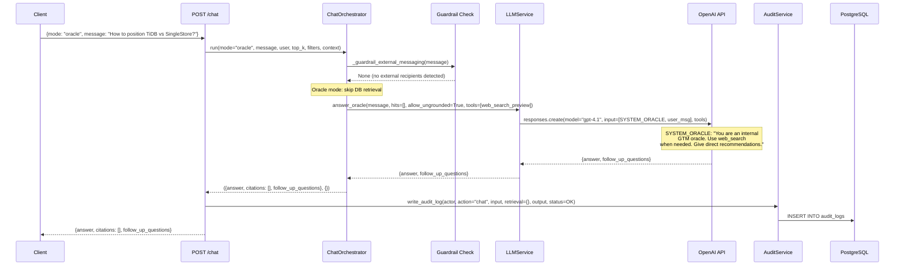
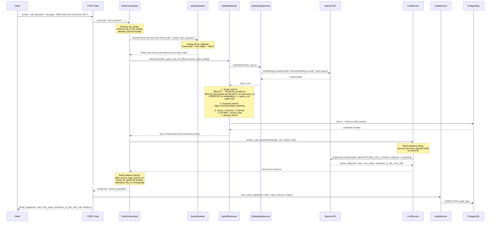
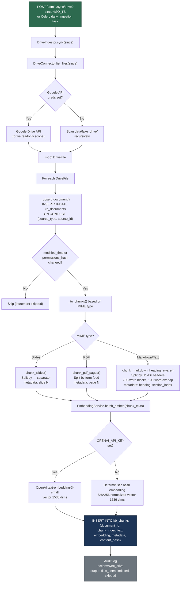
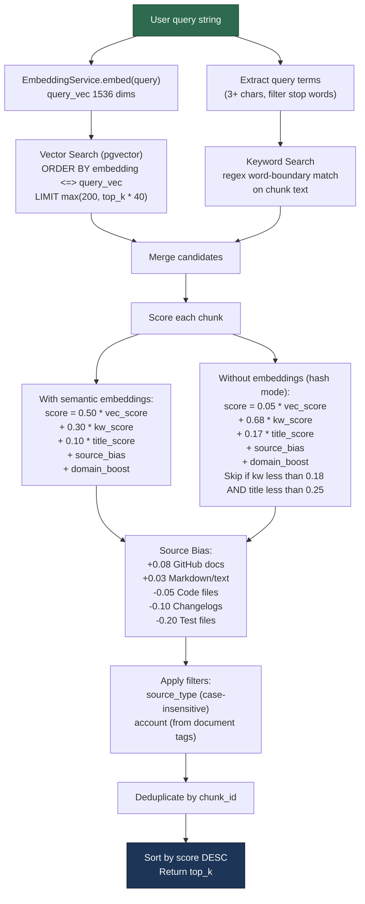
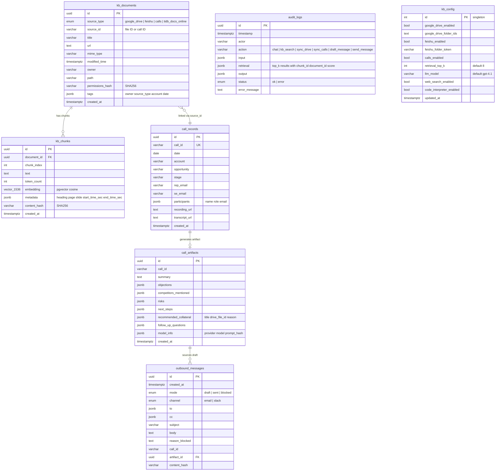
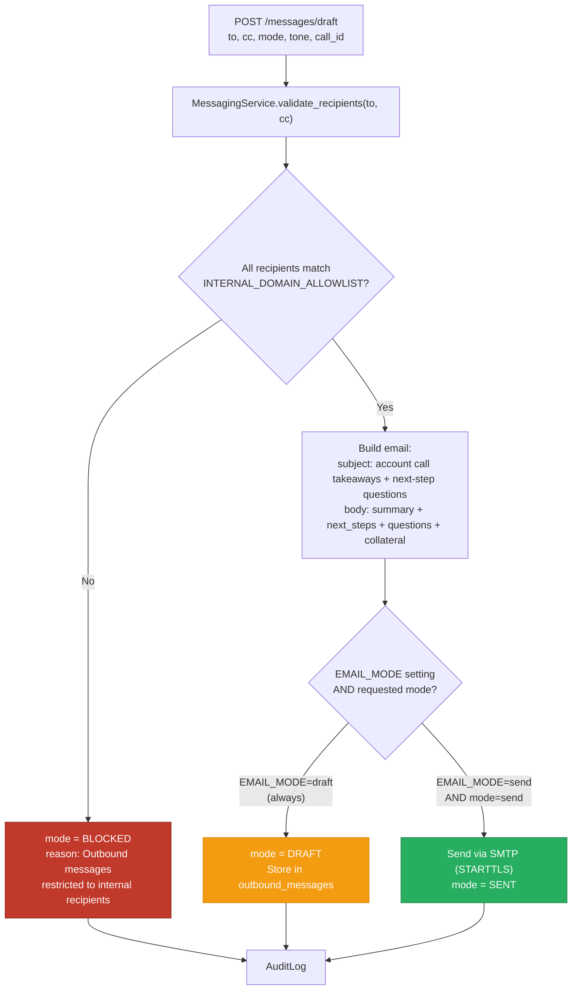

# GTM Copilot — AI-Powered GTM Platform

GTM Copilot is an AI-powered go-to-market platform built for sales, marketing, and SE teams. It automates pre-call research, post-call follow-ups, competitive intelligence, and RAG-grounded chat — all grounded in company knowledge indexed from Google Drive, Feishu, TiDB docs, and TiDB GitHub. Users get role-specific dashboards (Sales Rep, Marketing, SE) backed by a shared account context, with AI that adapts over time through user feedback.

Built and maintained by Stephen Thorn.

---

## Architecture

### System Overview

```mermaid
graph TB
    subgraph clients["Clients"]
        UI["Next.js 14 Frontend<br/>(Sales / Marketing / SE Dashboards)"]
        CLI["KB CLI<br/>(kb sync / search / inspect)"]
        API_CLIENT["API Consumer<br/>(curl / Postman)"]
    end

    subgraph api_layer["FastAPI Backend (Python 3.11)"]
        CHAT_ROUTE["POST /chat"]
        KB_ROUTE["GET /kb/search<br/>GET /kb/inspect/:id"]
        ADMIN_ROUTE["POST /admin/sync/drive<br/>POST /admin/sync/calls<br/>POST /admin/sync/feishu<br/>GET /admin/health<br/>GET /admin/audit<br/>GET|PUT /admin/kb-config<br/>GET /admin/security/settings"]
        CALLS_ROUTE["GET /calls<br/>GET /calls/:id<br/>POST /calls/:id/regenerate-draft"]
        MSG_ROUTE["POST /messages/draft"]
        AUTH_ROUTE["Auth Service<br/>(OAuth / PKCE)"]
    end

    subgraph services["Core Services"]
        ORCH["ChatOrchestrator"]
        REWRITER["QueryRewriter"]
        RETRIEVER["HybridRetriever"]
        EMBED["EmbeddingService"]
        LLM["LLMService"]
        ARTIFACT["ArtifactGenerator"]
        MESSAGING["MessagingService"]
        AUDIT["AuditService"]
        TIDB_DOCS["TiDBDocsRetriever<br/>(live docs.pingcap.com)"]
    end

    subgraph ingest["Ingestion Pipelines"]
        DRIVE_CONN["DriveConnector"]
        DRIVE_ING["DriveIngestor"]
        FEISHU_CONN["FeishuConnector"]
        FEISHU_ING["FeishuIngestor"]
        CHORUS_CONN["CallConnector"]
        TRANSCRIPT_ING["TranscriptIngestor"]
        CHUNKER["Chunking Utils<br/>(markdown / pdf / slides / turns)"]
    end

    subgraph storage["Storage Layer"]
        PG[("PostgreSQL 16<br/>+ pgvector")]
        REDIS[("Redis<br/>(Celery broker)")]
    end

    subgraph external["External Services"]
        GDRIVE["Google Drive API"]
        FEISHU_API["Feishu (Lark) API"]
        CALL_API["Call Transcript API"]
        OPENAI["OpenAI API<br/>(Chat + Embeddings)"]
        DDG["DuckDuckGo<br/>(docs.pingcap.com search)"]
        SMTP_SVC["SMTP Server"]
        SLACK_API["Slack API"]
        FIRECRAWL["Firecrawl API"]
    end

    subgraph worker["Celery Worker + Beat"]
        WORKER["Background Tasks"]
        BEAT["Daily Ingestion Schedule<br/>(every 24h)"]
    end

    UI --> CHAT_ROUTE
    UI --> KB_ROUTE
    UI --> ADMIN_ROUTE
    UI --> CALLS_ROUTE
    UI --> MSG_ROUTE
    CLI --> KB_ROUTE
    API_CLIENT --> CHAT_ROUTE

    CHAT_ROUTE --> ORCH
    KB_ROUTE --> RETRIEVER
    ADMIN_ROUTE --> DRIVE_ING
    ADMIN_ROUTE --> TRANSCRIPT_ING
    ADMIN_ROUTE --> FEISHU_ING
    CALLS_ROUTE --> ARTIFACT
    MSG_ROUTE --> MESSAGING

    ORCH --> REWRITER
    ORCH --> RETRIEVER
    ORCH --> LLM
    ORCH --> AUDIT
    RETRIEVER --> EMBED
    RETRIEVER --> PG

    DRIVE_ING --> DRIVE_CONN
    DRIVE_ING --> CHUNKER
    DRIVE_ING --> EMBED
    DRIVE_CONN --> GDRIVE
    FEISHU_ING --> FEISHU_CONN
    FEISHU_ING --> CHUNKER
    FEISHU_ING --> EMBED
    FEISHU_CONN --> FEISHU_API
    TRANSCRIPT_ING --> CHORUS_CONN
    TRANSCRIPT_ING --> CHUNKER
    TRANSCRIPT_ING --> EMBED
    TRANSCRIPT_ING --> ARTIFACT
    CHORUS_CONN --> CALL_API

    EMBED --> OPENAI
    LLM --> OPENAI
    TIDB_DOCS --> DDG
    MESSAGING --> SMTP_SVC
    MESSAGING --> SLACK_API

    DRIVE_ING --> PG
    FEISHU_ING --> PG
    TRANSCRIPT_ING --> PG
    AUDIT --> PG

    WORKER --> DRIVE_ING
    WORKER --> TRANSCRIPT_ING
    BEAT --> WORKER
    WORKER --> REDIS
```



### RAG Query Flow — Oracle Mode (Direct LLM)



### RAG Query Flow — Call Assistant Mode (Grounded RAG)



### Ingestion Pipelines

#### Google Drive Ingestion



#### Call Transcript Ingestion

```mermaid
flowchart TB
    TRIGGER["POST /admin/sync/calls?since=YYYY-MM-DD<br/>or Celery daily_ingestion task"]

    TRIGGER --> TI["TranscriptIngestor.sync(since)"]
    TI --> CC["CallConnector.fetch_calls(since)"]

    CC --> CREDS{CALL_API_KEY<br/>set?}
    CREDS -->|Yes| CAPI["Call Transcript API<br/>(Bearer token auth)"]
    CREDS -->|No| FAKE["Load data/fake_calls/*.json"]

    CAPI --> CALLS["list of raw calls"]
    FAKE --> CALLS

    CALLS --> LOOP["For each raw call"]

    LOOP --> NORM["_normalize(payload)<br/>Standardize speaker_map, turns, metadata"]

    NORM --> UPSERT_CALL["_upsert_call()<br/>INSERT/UPDATE call records<br/>(call_id, date, account,<br/>opportunity, stage, rep_email,<br/>se_email, participants)"]

    UPSERT_CALL --> UPSERT_DOC["_upsert_document()<br/>INSERT/UPDATE kb_documents<br/>source_type=calls"]

    UPSERT_DOC --> CHUNK["_replace_chunks()<br/>chunk_transcript_turns()"]

    CHUNK --> CHUNK_DETAIL["Accumulate turns into chunks:<br/>45-90 second windows or 700 tokens<br/>Include speaker name + role + HH:MM:SS<br/>metadata: start_time_sec, end_time_sec"]

    CHUNK_DETAIL --> EMBED["EmbeddingService.batch_embed(chunk_texts)"]
    EMBED --> STORE_CHUNKS["DELETE old chunks for document<br/>INSERT new kb_chunks with embeddings"]

    STORE_CHUNKS --> GEN_ART["_replace_artifact()<br/>ArtifactGenerator.generate()"]

    GEN_ART --> HEURISTIC["Heuristic extraction:<br/>- Competitors detected<br/>- Objections flagged<br/>- Risks: standard set + LLM-generated<br/>- Next steps: standard set + LLM-generated<br/>- Recommended collateral links"]

    HEURISTIC --> STORE_ART["INSERT/UPDATE call_artifacts<br/>(summary, objections, competitors_mentioned,<br/>risks, next_steps, recommended_collateral,<br/>follow_up_questions, model_info)"]

    STORE_ART --> AUDIT["AuditLog<br/>action=sync_calls<br/>output: calls_seen, processed"]

    style TRIGGER fill:#2d6a4f,stroke:#1b4332,color:#fff
    style STORE_CHUNKS fill:#1d3557,stroke:#0d1b2a,color:#fff
    style STORE_ART fill:#1d3557,stroke:#0d1b2a,color:#fff
    style AUDIT fill:#6c757d,stroke:#495057,color:#fff
```



### Hybrid Retrieval Scoring



### Database Schema



### Messaging Guard Rails



[View interactive Excalidraw diagram](./docs/architecture.excalidraw)

---

## Tech Stack

| Layer | Technology |
|---|---|
| Frontend | Next.js 14 / React 18 |
| Backend | Python 3.11 / FastAPI |
| Database | TiDB Cloud (vector search + full-text + relational) |
| Background Jobs | Celery + Redis |
| LLM | OpenAI (user-provided API key, extensible) |
| Embeddings | OpenAI `text-embedding-3-small` (1536 dimensions) |
| Web Scraping | Firecrawl API |
| Containerization | Docker Compose |

---

## Quick Start

```bash
cp .env.example .env
# Fill in required keys (see Configuration section below)
docker compose -f infra/docker-compose.yml up -d
# Frontend: http://localhost:3000
# API docs: http://localhost:8000/docs
```

Trigger initial knowledge sync:

```bash
curl -X POST "http://localhost:8000/admin/sync/drive"
curl -X POST "http://localhost:8000/admin/sync/calls"
```

---

## Configuration

Copy `.env.example` to `.env` and fill in the values below.

### Core

| Variable | Description |
|---|---|
| `APP_ENV` | Environment (`dev` / `prod`) |
| `APP_PORT` | API port (default `8000`) |
| `CORS_ALLOW_ORIGINS` | Comma-separated allowed origins for CORS |

### Database

| Variable | Description |
|---|---|
| `DATABASE_URL` | PostgreSQL connection string (local dev fallback) |
| `DATABASE_PROVIDER` | `postgresql` or `tidb` |
| `TIDB_HOST` | TiDB Cloud host |
| `TIDB_PORT` | TiDB Cloud port (default `4000`) |
| `TIDB_USER` | TiDB Cloud username |
| `TIDB_PASSWORD` | TiDB Cloud password |
| `TIDB_DATABASE` | TiDB Cloud database name |
| `TIDB_SSL_CA` | Path to TiDB Cloud CA certificate |
| `REDIS_URL` | Redis connection string |

### LLM / Embeddings

| Variable | Description |
|---|---|
| `OPENAI_API_KEY` | OpenAI API key |
| `OPENAI_BASE_URL` | Optional custom endpoint (Azure, self-hosted) |
| `OPENAI_MODEL` | Chat model (default `gpt-4.1`) |
| `OPENAI_EMBEDDING_MODEL` | Embedding model (default `text-embedding-3-small`) |
| `EMBEDDING_DIMENSIONS` | Embedding vector size (default `1536`) |
| `RETRIEVAL_TOP_K` | Number of chunks to retrieve per query (default `8`) |

### Security

| Variable | Description |
|---|---|
| `ENTERPRISE_MODE` | Enable enterprise security controls |
| `SECURITY_REQUIRE_PRIVATE_LLM_ENDPOINT` | Require non-public LLM base URL |
| `SECURITY_ALLOWED_LLM_BASE_URLS` | Allowlist of permitted LLM endpoints |
| `SECURITY_REDACT_BEFORE_LLM` | Redact PII before sending to LLM |
| `SECURITY_REDACT_AUDIT_LOGS` | Redact sensitive data in audit logs |
| `SECURITY_TRUSTED_HOST_ALLOWLIST` | Comma-separated trusted host headers |
| `INTERNAL_DOMAIN_ALLOWLIST` | Domains permitted for outbound messaging |

### Google Drive

| Variable | Description |
|---|---|
| `GOOGLE_DRIVE_CLIENT_ID` | Google OAuth client ID |
| `GOOGLE_DRIVE_CLIENT_SECRET` | Google OAuth client secret |
| `GOOGLE_DRIVE_SERVICE_ACCOUNT_JSON` | Path to service account JSON (optional) |
| `GOOGLE_DRIVE_TOKEN_ENCRYPTION_KEY` | AES key for encrypting stored OAuth tokens |
| `GOOGLE_DRIVE_ROOT_FOLDER_ID` | Root folder to sync (optional) |
| `GOOGLE_DRIVE_FOLDER_IDS` | Comma-separated folder IDs to index |

### Feishu / Lark

| Variable | Description |
|---|---|
| `FEISHU_APP_ID` | Feishu app ID |
| `FEISHU_APP_SECRET` | Feishu app secret |
| `FEISHU_BASE_URL` | Feishu API base URL |

### Call Transcripts

| Variable | Description |
|---|---|
| `CALL_PROVIDER` | Provider name (`generic`, or Chorus-compatible) |
| `CALL_API_KEY` | API key for call transcript provider |
| `CALL_BASE_URL` | Base URL for call transcript provider |

### Messaging

| Variable | Description |
|---|---|
| `EMAIL_MODE` | `draft` (compose only) or `send` |
| `SMTP_HOST` | SMTP server hostname |
| `SMTP_PORT` | SMTP port (default `587`) |
| `SMTP_USERNAME` | SMTP username |
| `SMTP_FROM` | From address for outbound email |
| `SLACK_BOT_TOKEN` | Slack bot OAuth token |
| `SLACK_SIGNING_SECRET` | Slack signing secret for webhook verification |
| `SLACK_DEFAULT_CHANNEL` | Default channel for notifications |

---

## Features by Role

All users can access all dashboards. Role determines default landing page.

### Sales Rep
- Pre-call hub: upcoming meetings with auto-generated research status
- 7-section pre-call reports (prospect info, company context, architecture hypothesis, pain hypothesis, TiDB value props, meeting goal, meeting flow)
- Manual research trigger: enter a company name, verify, research
- Post-call hub: "What we heard / What it means / Next steps" + draft follow-up email
- Call coaching: AI reviews past calls for patterns and objection handling
- Deal health scoring, pipeline analytics, win/loss analysis
- Account 360: unified view of all research, calls, emails, deal history

### Marketing
- Competitive intelligence: auto-monitored competitor landscape (news, launches, pricing, G2 reviews)
- Battle card generator (auto-created and updated)
- Content engine: blog drafts, case studies, email campaigns, one-pagers
- Content gap analysis from rep questions with no matching content
- Market research: industry trends, ICP refinement

### SE
- Extended architecture analysis per prospect
- Tech stack mapping (BuiltWith, job posts, GitHub signals)
- Demo and POC prep scripts matched to prospect pain
- Technical objection handling with linked TiDB docs and GitHub issues
- POC status tracker with shared context to sales rep

### Admin
- User management: invite users, assign roles
- Source registry: add/remove/configure global research sources
- API key management: Firecrawl, ZoomInfo, BuiltWith, etc.
- Sync health: Drive, Feishu, Chorus, Salesforce status
- AI coaching panel: view all refinements across all users, promote to team, edit, disable, track effectiveness
- MCP server configuration: enable/disable per server, configure API keys
- API cost tracking: daily/weekly/monthly spend per external source

---

## MCP Integrations

MCP servers give the LLM direct tool access to live data during chat. Each enabled server registers its tools at startup; the LLM autonomously decides which to invoke based on the user's query.

| MCP Server | Purpose | Primary Users |
|---|---|---|
| TiDB Cloud MCP | Query accounts, deals, research reports, call history | All |
| TiDB Observability MCP | Cluster health, query performance, metrics | SE |
| Salesforce MCP | Live CRM pipeline, deals, contacts | Sales |
| Slack MCP | Search conversations, post messages | All |
| Google Drive MCP | Search and retrieve documents | All |
| Feishu MCP | Search and retrieve Feishu docs | All |
| Gmail MCP (read-only) | Search emails for context | Sales, SE |
| Google Calendar MCP (read-only) | Check schedules and meetings | Sales |
| ZoomInfo MCP | Live prospect and company lookup | Sales, Marketing |
| LinkedIn Sales Nav MCP | Prospect research, org mapping | Sales |
| Firecrawl MCP | On-demand web scraping in chat | All |
| GitHub MCP | TiDB repo search for technical depth | SE |
| Crunchbase MCP | Funding and growth signals | Sales, Marketing |

---

## Key Functions Reference

### ChatOrchestrator (`services/chat_orchestrator.py`)

```python
class ChatOrchestrator:
    def run(*, mode: str, user: str, message: str,
            top_k: int, filters: dict, context: dict) -> tuple[dict, dict]
    # mode="oracle": LLM-direct (no DB), allow_ungrounded=True
    # mode="call_assistant": QueryRewriter -> HybridRetriever -> LLM with evidence
    # Returns (response_dict, retrieval_payload)
```

### HybridRetriever (`retrieval/service.py`)

```python
class HybridRetriever:
    def search(query: str, *, top_k: int = 8,
               filters: dict | None = None) -> list[RetrievedChunk]
    # 1. Vector: ORDER BY embedding <=> query_vec LIMIT max(200, top_k*40)
    # 2. Keyword: regex word-boundary match on chunk text
    # 3. Score: 0.50*vec + 0.30*kw + 0.10*title + source_bias + domain_boost
    # 4. Filter by source_type, account
    # 5. Dedup by chunk_id, sort by score DESC, return top_k
```

### EmbeddingService (`services/embedding.py`)

```python
class EmbeddingService:
    def embed(text: str) -> list[float]          # single text -> vector[1536]
    def batch_embed(texts: Iterable[str]) -> list[list[float]]  # batch
    # With OPENAI_API_KEY: calls text-embedding-3-small
    # Without: SHA256 hash -> deterministic normalized vector
```

### LLMService (`services/llm.py`)

```python
class LLMService:
    def answer_oracle(message, hits, *, model=None, tools=None,
                      allow_ungrounded=False) -> dict
    # Returns {answer, follow_up_questions}
    # Fallback: _local_oracle_synthesis() (lexical ranking + heuristic response)

    def answer_call_assistant(message, hits, *, model=None, tools=None) -> dict
    # Returns {what_happened, risks, next_steps, questions_to_ask_next_call}
```

### Key SQL Queries

**Vector similarity search (pgvector)**:
```sql
SELECT kc.id, kc.text, kc.metadata, kc.embedding,
       kd.title, kd.source_type, kd.source_id, kd.url, kd.tags
FROM kb_chunks kc
JOIN kb_documents kd ON kd.id = kc.document_id
ORDER BY kc.embedding <=> :query_vec
LIMIT :candidate_limit
```

**ivfflat index**:
```sql
CREATE INDEX ix_kb_chunks_embedding
ON kb_chunks USING ivfflat (embedding vector_cosine_ops)
WITH (lists = 100);
```

---

## Development

### Run API locally

```bash
cd api
python -m venv .venv
source .venv/bin/activate
pip install -e ".[dev]"
alembic upgrade head
uvicorn app.main:app --reload
```

### Run Celery worker and scheduler

```bash
cd api
celery -A app.worker.celery_app worker --loglevel=info
celery -A app.worker.celery_app beat --loglevel=info
```

### Run UI locally

```bash
cd ui
npm install
npm run dev
# http://localhost:3000
```

### Repository layout

```
/api
  /app
    /api/routes        # FastAPI route handlers
    /core              # Config, auth, security
    /db                # Database models and migrations
    /ingest            # Knowledge source connectors
    /models            # ORM models
    /prompts           # LLM prompt templates
    /retrieval         # Hybrid search service
    /schemas           # Pydantic request/response schemas
    /services          # Business logic (research, chat, notifications)
    /utils             # Shared utilities
  /alembic             # Database migrations
/workers               # Celery task definitions
/ui                    # Next.js frontend
/infra                 # Docker Compose files
/tests                 # Test suite
/data
  /fake_drive          # Local fixture documents for dev
  /fake_calls          # Local fixture call transcripts for dev
/scripts               # Utility scripts
/docs
  architecture.excalidraw  # System architecture diagram
```

### Adding a knowledge source connector

Implement a connector + ingestor pair in `api/app/ingest/` that outputs normalized documents and writes to `knowledge_index`. See `drive_connector.py` and `feishu_connector.py` for reference implementations.

---

## Security

- No secrets committed to source; all credentials come from environment variables.
- OAuth tokens encrypted at rest (AES-256, configurable key).
- OpenAI API keys stored per-user, AES-256 encrypted, decrypted only at runtime.
- Outbound messaging is domain-allowlisted (`INTERNAL_DOMAIN_ALLOWLIST`).
- `SECURITY_REDACT_BEFORE_LLM=true` strips PII before sending prompts to the LLM.
- All sync, chat, generation, and messaging actions are audit-logged.
- Enterprise mode (`ENTERPRISE_MODE=true`) enforces private LLM endpoint requirement and additional controls.

---

## License

MIT
