# GTM Copilot — AI-Powered GTM Platform

GTM Copilot is an AI-powered go-to-market platform built for sales, marketing, and SE teams. It automates pre-call research, post-call follow-ups, competitive intelligence, and RAG-grounded chat — all grounded in company knowledge indexed from Google Drive, Feishu, TiDB docs, and TiDB GitHub. Users get role-specific dashboards (Sales Rep, Marketing, SE) backed by a shared account context, with AI that adapts over time through user feedback.

Built and maintained by Stephen Thorn.

---

## How It Works

### Data Sources → AI Outputs

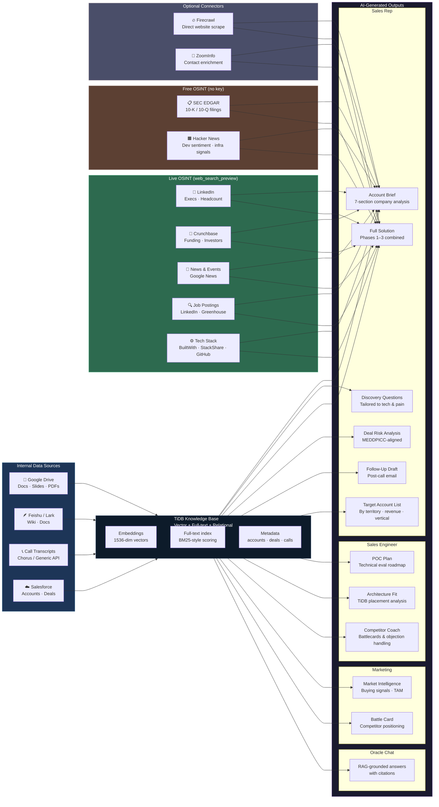

---

### How GTM Copilot Generates an Answer

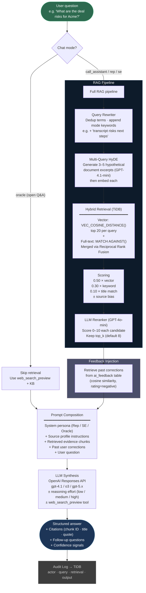

---

## Architecture

### System Overview

```mermaid
graph TB
    subgraph clients["Clients"]
        UI["Next.js 14 Frontend<br/>(Sales / Marketing / SE Dashboards)"]
        CLI["KB CLI<br/>(kb sync / search / inspect)"]
        API_CLIENT["API Consumer<br/>(curl / Postman)"]
    end

    subgraph api_layer["FastAPI Backend (Python 3.11)"]
        CHAT_ROUTE["POST /chat"]
        KB_ROUTE["GET /kb/search<br/>GET /knowledge"]
        REP_ROUTE["POST /rep/account-brief<br/>POST /rep/follow-up-draft<br/>POST /rep/deal-risk"]
        SE_ROUTE["POST /se/poc-plan<br/>POST /se/architecture-fit<br/>POST /se/competitor-coach"]
        MKT_ROUTE["POST /marketing/intelligence<br/>POST /marketing/battle-card"]
        ADMIN_ROUTE["POST /admin/sync/*<br/>GET /admin/audit<br/>GET|PUT /admin/kb-config<br/>POST /admin/mcp/enable"]
        AUTH_ROUTE["POST /auth/google<br/>POST /auth/openai-key<br/>POST /auth/connect-provider"]
        MSG_ROUTE["POST /messages/draft"]
        SLACK_ROUTE["POST /slack/events<br/>POST /slack/actions"]
    end

    subgraph services["Core Services"]
        ORCH["ChatOrchestrator<br/>(oracle / call_assistant / research)"]
        REWRITER["QueryRewriter"]
        RETRIEVER_V1["HybridRetriever (v1)<br/>VEC_COSINE_DISTANCE()"]
        RETRIEVER_V2["HybridRetrievalService (v2)<br/>TiDB: VEC_COSINE_DISTANCE() + RRF"]
        EMBED["EmbeddingService"]
        LLM["LLMService<br/>(OpenAI + Anthropic/MiniMax + Codex)"]
        GTM["GTMModuleService<br/>(12+ role-specific modules)"]
        RESEARCH["AccountBriefResearcher<br/>PostCallPipeline<br/>RefinementService"]
        ARTIFACT["ArtifactGenerator"]
        MESSAGING["MessagingService"]
        AUDIT["AuditService"]
        TIDB_DOCS["TiDBDocsRetriever<br/>(live docs.pingcap.com)"]
    end

    subgraph mcp["MCP Server Integrations (15)"]
        MCP_TIDB["TiDB Cloud + Observability"]
        MCP_CRM["Salesforce"]
        MCP_INTEL["ZoomInfo / LinkedIn / Crunchbase"]
        MCP_COMM["Slack / Gmail / Calendar"]
        MCP_CONTENT["Drive / Feishu / GitHub / Firecrawl"]
    end

    subgraph ingest["Ingestion Pipelines"]
        DRIVE_ING["DriveIngestor + DriveConnector"]
        FEISHU_ING["FeishuIngestor + FeishuConnector"]
        TRANSCRIPT_ING["TranscriptIngestor + CallConnector"]
        SF_SYNC["SalesforceSyncService"]
        CHUNKER["Chunking Utils<br/>(markdown / pdf / slides / turns)"]
    end

    subgraph storage["Storage Layer"]
        TIDB[("TiDB Cloud v8.5<br/>VEC_COSINE_DISTANCE()<br/>MATCH AGAINST fulltext<br/>MySQL protocol :4000")]
        REDIS[("Redis<br/>(Celery broker + sessions)")]
    end

    subgraph external["External Services"]
        GDRIVE["Google Drive API"]
        FEISHU_API["Feishu (Lark) API"]
        CALL_API["Call Transcript API"]
        OPENAI["OpenAI API<br/>(Chat + Embeddings)"]
        FIRECRAWL["Firecrawl API"]
        SMTP_SVC["SMTP Server"]
        SLACK_API["Slack API"]
        SALESFORCE["Salesforce API"]
    end

    subgraph worker["Celery Worker + Beat"]
        WORKER["sync_drive / sync_calls<br/>sync_salesforce / research_task<br/>market_intel_task"]
        BEAT["Daily Ingestion<br/>(every 24h)"]
    end

    UI --> CHAT_ROUTE & REP_ROUTE & SE_ROUTE & MKT_ROUTE & ADMIN_ROUTE
    CLI --> KB_ROUTE
    API_CLIENT --> CHAT_ROUTE

    CHAT_ROUTE --> ORCH
    REP_ROUTE --> GTM
    SE_ROUTE --> GTM
    MKT_ROUTE --> GTM
    KB_ROUTE --> RETRIEVER_V1 & RETRIEVER_V2
    MSG_ROUTE --> MESSAGING
    SLACK_ROUTE --> SLACK_API
    AUTH_ROUTE --> OPENAI

    ORCH --> REWRITER & LLM & AUDIT
    ORCH --> RETRIEVER_V1 & RETRIEVER_V2
    GTM --> RESEARCH
    RESEARCH --> RETRIEVER_V2 & LLM
    RETRIEVER_V1 --> EMBED & TIDB
    RETRIEVER_V2 --> EMBED & TIDB

    LLM --> OPENAI
    LLM --> mcp

    DRIVE_ING --> GDRIVE & CHUNKER & EMBED
    FEISHU_ING --> FEISHU_API & CHUNKER & EMBED
    TRANSCRIPT_ING --> CALL_API & CHUNKER & EMBED & ARTIFACT
    SF_SYNC --> SALESFORCE

    DRIVE_ING & FEISHU_ING & TRANSCRIPT_ING & SF_SYNC --> TIDB
    AUDIT --> TIDB

    BEAT --> WORKER
    WORKER --> REDIS
    WORKER --> DRIVE_ING & TRANSCRIPT_ING & SF_SYNC
```

### RAG Query Flow — Oracle Mode (Direct LLM)

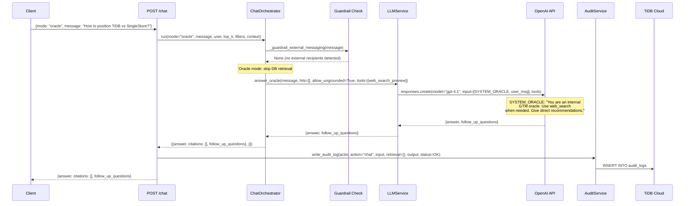

### RAG Query Flow — Call Assistant Mode (Grounded RAG)

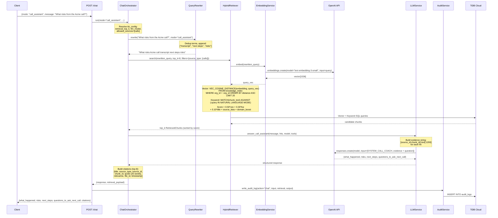

### Ingestion Pipelines

#### Google Drive Ingestion

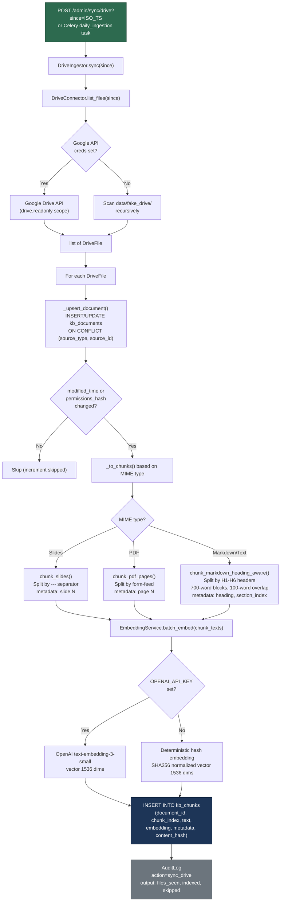

#### Call Transcript Ingestion

```mermaid
flowchart TB
    TRIGGER["POST /admin/sync/calls?since=YYYY-MM-DD<br/>or Celery daily_ingestion task"]

    TRIGGER --> TI["TranscriptIngestor.sync(since)"]
    TI --> CC["CallConnector.fetch_calls(since)"]

    CC --> CREDS{CALL_API_KEY<br/>set?}
    CREDS -->|Yes| CAPI["Call Transcript API<br/>(Bearer token auth)"]
    CREDS -->|No| FAKE["Load data/fake_calls/*.json"]

    CAPI --> CALLS["list of raw calls"]
    FAKE --> CALLS

    CALLS --> LOOP["For each raw call"]

    LOOP --> NORM["_normalize(payload)<br/>Standardize speaker_map, turns, metadata"]

    NORM --> UPSERT_CALL["_upsert_call()<br/>INSERT/UPDATE call records<br/>(call_id, date, account,<br/>opportunity, stage, rep_email,<br/>se_email, participants)"]

    UPSERT_CALL --> UPSERT_DOC["_upsert_document()<br/>INSERT/UPDATE kb_documents<br/>source_type=calls"]

    UPSERT_DOC --> CHUNK["_replace_chunks()<br/>chunk_transcript_turns()"]

    CHUNK --> CHUNK_DETAIL["Accumulate turns into chunks:<br/>45-90 second windows or 700 tokens<br/>Include speaker name + role + HH:MM:SS<br/>metadata: start_time_sec, end_time_sec"]

    CHUNK_DETAIL --> EMBED["EmbeddingService.batch_embed(chunk_texts)"]
    EMBED --> STORE_CHUNKS["DELETE old chunks for document<br/>INSERT new kb_chunks with embeddings"]

    STORE_CHUNKS --> GEN_ART["_replace_artifact()<br/>ArtifactGenerator.generate()"]

    GEN_ART --> HEURISTIC["Heuristic extraction:<br/>- Competitors detected<br/>- Objections flagged<br/>- Risks: standard set + LLM-generated<br/>- Next steps: standard set + LLM-generated<br/>- Recommended collateral links"]

    HEURISTIC --> STORE_ART["INSERT/UPDATE call_artifacts<br/>(summary, objections, competitors_mentioned,<br/>risks, next_steps, recommended_collateral,<br/>follow_up_questions, model_info)"]

    STORE_ART --> AUDIT["AuditLog<br/>action=sync_calls<br/>output: calls_seen, processed"]

    style TRIGGER fill:#2d6a4f,stroke:#1b4332,color:#fff
    style STORE_CHUNKS fill:#1d3557,stroke:#0d1b2a,color:#fff
    style STORE_ART fill:#1d3557,stroke:#0d1b2a,color:#fff
    style AUDIT fill:#6c757d,stroke:#495057,color:#fff
```

### Hybrid Retrieval Scoring

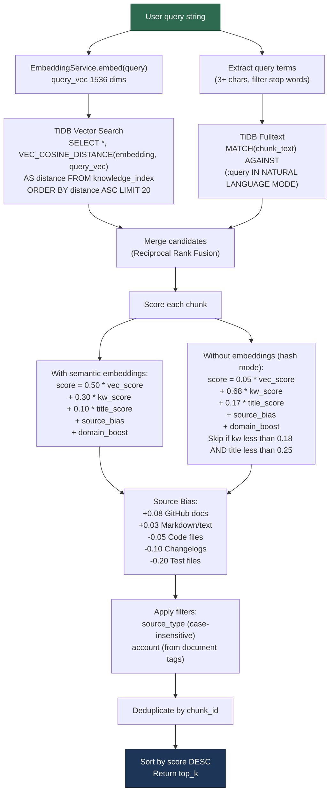

### Database Schema

#### V1 Tables (Knowledge Base + Calls)

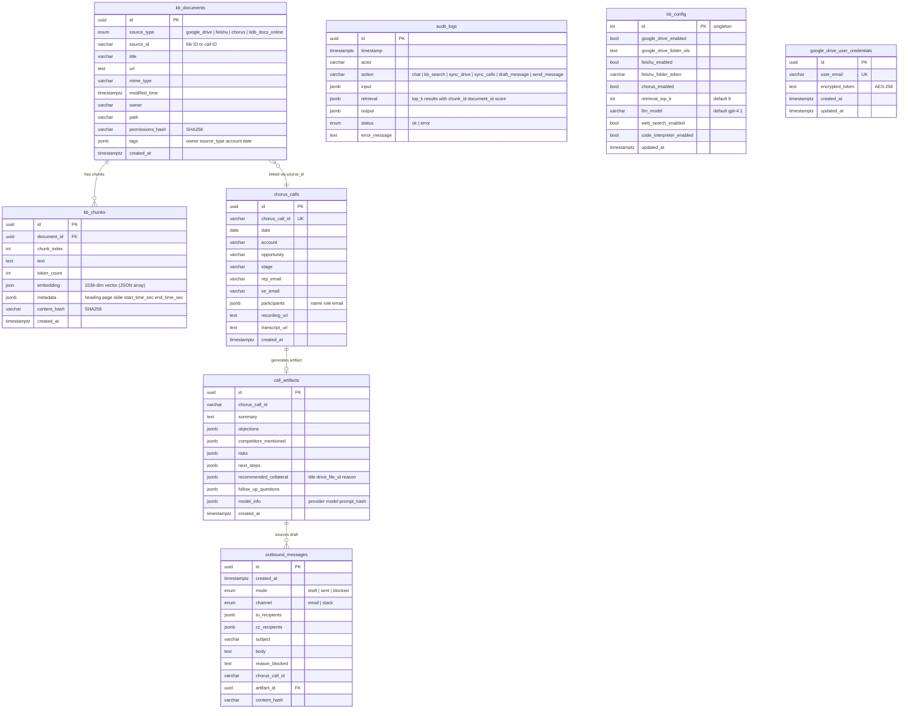

#### V2 Tables (Multi-Tenant GTM Platform)

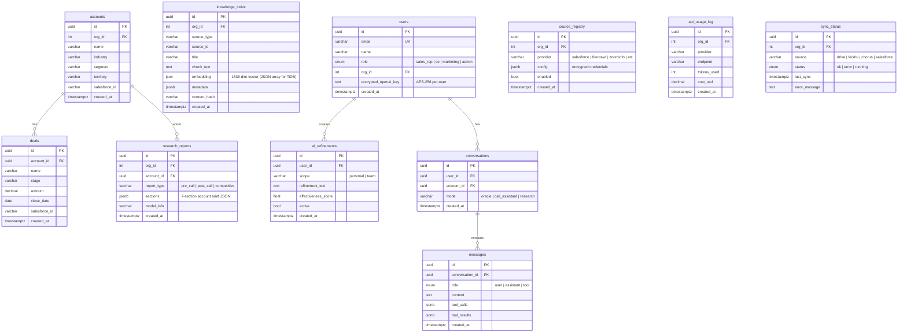

### Messaging Guard Rails

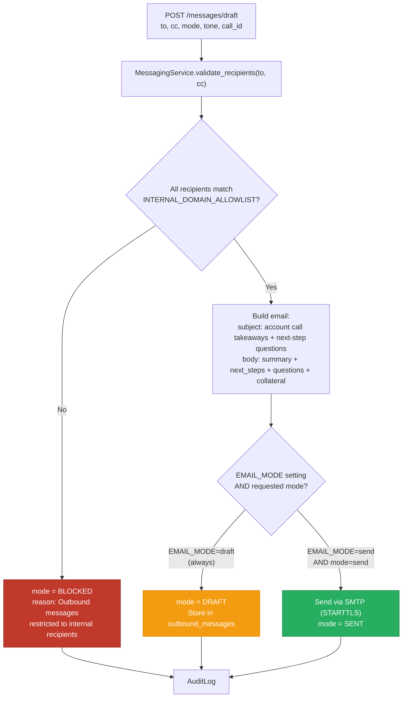

[View interactive Excalidraw diagram](./docs/architecture.excalidraw)

---

## Tech Stack

| Layer | Technology |
|---|---|
| Frontend | Next.js 14 / React 18 |
| Backend | Python 3.11 / FastAPI |
| Database | TiDB Cloud (vector search + full-text + relational) |
| Background Jobs | Celery + Redis |
| LLM | OpenAI (user-provided API key, extensible) |
| Embeddings | OpenAI `text-embedding-3-small` (1536 dimensions) |
| Web Scraping | Firecrawl API |
| Containerization | Docker Compose |

---

## Quick Start

```bash
cp .env.example .env
# Fill in required keys (see Configuration section below)
docker compose -f infra/docker-compose.yml up -d
# Frontend: http://localhost:3000
# API docs: http://localhost:8000/docs
```

Trigger initial knowledge sync:

```bash
curl -X POST "http://localhost:8000/admin/sync/drive"
curl -X POST "http://localhost:8000/admin/sync/calls"
```

---

## Configuration

Copy `.env.example` to `.env` and fill in the values below.

### Core

| Variable | Description |
|---|---|
| `APP_ENV` | Environment (`dev` / `prod`) |
| `APP_PORT` | API port (default `8000`) |
| `CORS_ALLOW_ORIGINS` | Comma-separated allowed origins for CORS |

### Database

| Variable | Description |
|---|---|
| `TIDB_HOST` | TiDB Cloud host |
| `TIDB_PORT` | TiDB Cloud port (default `4000`) |
| `TIDB_USER` | TiDB Cloud username |
| `TIDB_PASSWORD` | TiDB Cloud password |
| `TIDB_DATABASE` | TiDB Cloud database name |
| `TIDB_SSL_CA` | Path to TiDB Cloud CA certificate |
| `REDIS_URL` | Redis connection string |

### LLM / Embeddings

| Variable | Description |
|---|---|
| `OPENAI_API_KEY` | OpenAI API key |
| `OPENAI_BASE_URL` | Optional custom endpoint (Azure, self-hosted) |
| `OPENAI_MODEL` | Chat model (default `gpt-4.1`) |
| `OPENAI_EMBEDDING_MODEL` | Embedding model (default `text-embedding-3-small`) |
| `EMBEDDING_DIMENSIONS` | Embedding vector size (default `1536`) |
| `RETRIEVAL_TOP_K` | Number of chunks to retrieve per query (default `8`) |

### Security

| Variable | Description |
|---|---|
| `ENTERPRISE_MODE` | Enable enterprise security controls |
| `SECURITY_REQUIRE_PRIVATE_LLM_ENDPOINT` | Require non-public LLM base URL |
| `SECURITY_ALLOWED_LLM_BASE_URLS` | Allowlist of permitted LLM endpoints |
| `SECURITY_REDACT_BEFORE_LLM` | Redact PII before sending to LLM |
| `SECURITY_REDACT_AUDIT_LOGS` | Redact sensitive data in audit logs |
| `SECURITY_TRUSTED_HOST_ALLOWLIST` | Comma-separated trusted host headers |
| `INTERNAL_DOMAIN_ALLOWLIST` | Domains permitted for outbound messaging |

### Google Drive

| Variable | Description |
|---|---|
| `GOOGLE_DRIVE_CLIENT_ID` | Google OAuth client ID |
| `GOOGLE_DRIVE_CLIENT_SECRET` | Google OAuth client secret |
| `GOOGLE_DRIVE_SERVICE_ACCOUNT_JSON` | Path to service account JSON (optional) |
| `GOOGLE_DRIVE_TOKEN_ENCRYPTION_KEY` | AES key for encrypting stored OAuth tokens |
| `GOOGLE_DRIVE_ROOT_FOLDER_ID` | Root folder to sync (optional) |
| `GOOGLE_DRIVE_FOLDER_IDS` | Comma-separated folder IDs to index |

### Feishu / Lark

| Variable | Description |
|---|---|
| `FEISHU_APP_ID` | Feishu app ID |
| `FEISHU_APP_SECRET` | Feishu app secret |
| `FEISHU_BASE_URL` | Feishu API base URL |

### Call Transcripts

| Variable | Description |
|---|---|
| `CALL_PROVIDER` | Provider name (`generic`, or Chorus-compatible) |
| `CALL_API_KEY` | API key for call transcript provider |
| `CALL_BASE_URL` | Base URL for call transcript provider |

### Messaging

| Variable | Description |
|---|---|
| `EMAIL_MODE` | `draft` (compose only) or `send` |
| `SMTP_HOST` | SMTP server hostname |
| `SMTP_PORT` | SMTP port (default `587`) |
| `SMTP_USERNAME` | SMTP username |
| `SMTP_FROM` | From address for outbound email |
| `SLACK_BOT_TOKEN` | Slack bot OAuth token |
| `SLACK_SIGNING_SECRET` | Slack signing secret for webhook verification |
| `SLACK_DEFAULT_CHANNEL` | Default channel for notifications |

---

## Features by Role

All users can access all dashboards. Role determines default landing page.

### Sales Rep
- Pre-call hub: upcoming meetings with auto-generated research status
- 7-section pre-call reports (prospect info, company context, architecture hypothesis, pain hypothesis, TiDB value props, meeting goal, meeting flow)
- Manual research trigger: enter a company name, verify, research
- Post-call hub: "What we heard / What it means / Next steps" + draft follow-up email
- Call coaching: AI reviews past calls for patterns and objection handling
- Deal health scoring, pipeline analytics, win/loss analysis
- Account 360: unified view of all research, calls, emails, deal history

### Marketing
- Competitive intelligence: auto-monitored competitor landscape (news, launches, pricing, G2 reviews)
- Battle card generator (auto-created and updated)
- Content engine: blog drafts, case studies, email campaigns, one-pagers
- Content gap analysis from rep questions with no matching content
- Market research: industry trends, ICP refinement

### SE
- Extended architecture analysis per prospect
- Tech stack mapping (BuiltWith, job posts, GitHub signals)
- Demo and POC prep scripts matched to prospect pain
- Technical objection handling with linked TiDB docs and GitHub issues
- POC status tracker with shared context to sales rep

### Admin
- User management: invite users, assign roles
- Source registry: add/remove/configure global research sources
- API key management: Firecrawl, ZoomInfo, BuiltWith, etc.
- Sync health: Drive, Feishu, Chorus, Salesforce status
- AI coaching panel: view all refinements across all users, promote to team, edit, disable, track effectiveness
- MCP server configuration: enable/disable per server, configure API keys
- API cost tracking: daily/weekly/monthly spend per external source

---

## MCP Integrations

MCP servers give the LLM direct tool access to live data during chat. Each enabled server registers its tools at startup; the LLM autonomously decides which to invoke based on the user's query.

| MCP Server | Purpose | Primary Users |
|---|---|---|
| TiDB Cloud MCP | Query accounts, deals, research reports, call history | All |
| TiDB Observability MCP | Cluster health, query performance, metrics | SE |
| Salesforce MCP | Live CRM pipeline, deals, contacts | Sales |
| Slack MCP | Search conversations, post messages | All |
| Google Drive MCP | Search and retrieve documents | All |
| Feishu MCP | Search and retrieve Feishu docs | All |
| Gmail MCP (read-only) | Search emails for context | Sales, SE |
| Google Calendar MCP (read-only) | Check schedules and meetings | Sales |
| ZoomInfo MCP | Live prospect and company lookup | Sales, Marketing |
| LinkedIn Sales Nav MCP | Prospect research, org mapping | Sales |
| Firecrawl MCP | On-demand web scraping in chat | All |
| GitHub MCP | TiDB repo search for technical depth | SE |
| Crunchbase MCP | Funding and growth signals | Sales, Marketing |

---

## Key Functions Reference

### ChatOrchestrator (`services/chat_orchestrator.py`)

```python
class ChatOrchestrator:
    def run(*, mode: str, user: str, message: str,
            top_k: int, filters: dict, context: dict) -> tuple[dict, dict]
    # mode="oracle": LLM-direct (no DB), allow_ungrounded=True
    # mode="call_assistant": QueryRewriter -> HybridRetriever -> LLM with evidence
    # mode="research": GTMModuleService dispatch (account briefs, POC plans, etc.)
    # Returns (response_dict, retrieval_payload)
```

### HybridRetriever v1 (`retrieval/service.py`)

```python
class HybridRetriever:
    def search(query: str, *, top_k: int = 8,
               filters: dict | None = None) -> list[RetrievedChunk]
    # 1. Vector: VEC_COSINE_DISTANCE(embedding, query_vec) LIMIT top_k*40
    # 2. Keyword: MATCH(chunk_text) AGAINST(:query IN NATURAL LANGUAGE MODE)
    # 3. Score: 0.50*vec + 0.30*kw + 0.10*title + source_bias + domain_boost
    # 4. Filter by source_type, account; dedup by chunk_id
```

### HybridRetrievalService v2 (`services/indexing/retrieval.py`)

```python
class HybridRetrievalService:
    def search(query: str, org_id: int, *, top_k: int = 8,
               filters: dict | None = None) -> list[RetrievedChunk]
    # TiDB Cloud: VEC_COSINE_DISTANCE() + MATCH AGAINST fulltext
    # Merge via Reciprocal Rank Fusion (RRF)
    # Multi-tenant: all queries scoped by org_id
```

### EmbeddingService (`services/embedding.py`)

```python
class EmbeddingService:
    def embed(text: str) -> list[float]          # single text -> vector[1536]
    def batch_embed(texts: Iterable[str]) -> list[list[float]]  # batch
    # With OPENAI_API_KEY: calls text-embedding-3-small
    # Without: SHA256 hash -> deterministic normalized vector
```

### LLMService (`services/llm.py`)

```python
class LLMService:
    # Multi-client: OpenAI (primary) + Anthropic/MiniMax (fallback) + Codex (JWT auth)
    def answer_oracle(message, hits, *, model=None, tools=None,
                      allow_ungrounded=False) -> dict
    # Returns {answer, follow_up_questions}
    # Fallback: _local_oracle_synthesis() (lexical ranking + heuristic response)

    def answer_call_assistant(message, hits, *, model=None, tools=None) -> dict
    # Returns {what_happened, risks, next_steps, questions_to_ask_next_call}
```

### GTMModuleService (`services/gtm_modules.py`)

```python
class GTMModuleService:
    # 12+ role-specific AI modules:
    # Sales: rep_account_brief, rep_discovery_questions, rep_follow_up_draft, rep_deal_risk
    # SE: se_poc_plan, se_poc_readiness, se_architecture_fit, se_competitor_coach
    # Marketing: marketing_intelligence, marketing_battle_card
    # Each module: retrieves from knowledge_index -> LLM generation -> stores result
```

### Key SQL Queries

**TiDB vector search (production)**:
```sql
SELECT *, VEC_COSINE_DISTANCE(embedding, :query_vec) AS distance
FROM knowledge_index
WHERE org_id = :org_id
ORDER BY distance ASC
LIMIT 20
```

**TiDB fulltext search**:
```sql
SELECT *, MATCH(chunk_text) AGAINST(:query IN NATURAL LANGUAGE MODE) AS relevance
FROM knowledge_index
WHERE org_id = :org_id AND MATCH(chunk_text) AGAINST(:query IN NATURAL LANGUAGE MODE)
ORDER BY relevance DESC
LIMIT 20
```

---

## Development

### Run API locally

```bash
cd api
python -m venv .venv
source .venv/bin/activate
pip install -e ".[dev]"
alembic upgrade head
uvicorn app.main:app --reload
```

### Run Celery worker and scheduler

```bash
cd api
celery -A app.worker.celery_app worker --loglevel=info
celery -A app.worker.celery_app beat --loglevel=info
```

### Run UI locally

```bash
cd ui
npm install
npm run dev
# http://localhost:3000
```

### Repository layout

```
/api
  /app
    /api/routes        # FastAPI endpoints: chat, kb, rep, se, marketing, admin, auth, slack
    /core              # Settings, constants, auth
    /db                # SQLAlchemy base, session factory (TiDB Cloud), init_db
    /ingest            # Drive + Feishu + Chorus connectors and ingestors
    /models            # ORM models: v1 (kb_documents, kb_chunks, chorus_calls, etc.)
                       #              v2 (users, accounts, deals, knowledge_index, etc.)
    /prompts           # System prompt templates (oracle, call coach)
    /retrieval         # HybridRetriever v1
    /schemas           # Pydantic request/response contracts
    /services
      /chat_orchestrator.py  # RAG orchestration (oracle / call_assistant / research)
      /llm.py               # Multi-client LLM (OpenAI + Anthropic + Codex)
      /embedding.py          # Embedding service (OpenAI + hash fallback)
      /gtm_modules.py        # 12+ role-specific AI modules
      /messaging.py           # Email draft/send with domain guard rails
      /slack.py               # Webhook verification + async posting
      /audit.py               # Action logging
      /query_rewrite.py       # Query rewriting
      /token_crypto.py        # AES-256 encryption for stored keys
      /indexing/
        retrieval.py          # HybridRetrievalService v2 (TiDB-aware, RRF)
      /research/
        account_brief_researcher.py  # 7-section pre-call research
        postcall_pipeline.py         # Post-call action extraction
        refinement_service.py        # User feedback + effectiveness tracking
      /connectors/
        salesforce_sync.py    # CRM account/deal sync
        firecrawl.py          # On-demand web scraping
      /auth/
        google_oauth.py       # Google OAuth + PKCE
      /mcp/                   # 15 MCP server integrations
    /utils             # Chunking, redaction, hashing, email utils
  /alembic             # DB migrations (TiDB Cloud)
/workers               # Celery task definitions
/ui                    # Next.js 14 frontend (Sales / Marketing / SE dashboards)
/infra                 # Docker Compose: TiDB v8.5 + Redis + API + Worker + Beat + UI
/tests                 # Unit + integration tests
/data
  /fake_drive          # Local fixture documents (+ optional GitHub repos)
  /fake_chorus         # Local fixture call transcripts
/scripts               # Utility scripts (sync_github_sources, seed_sqlite_mvp, etc.)
/docs
  architecture.excalidraw  # System architecture diagram
```

No demo transcripts or documents are bundled. Use `data/fake_drive` and `data/fake_calls` only for local, non-sensitive fixtures.

## Account Deal Memory

Rolling per-account MEDDPICC state that aggregates all calls (Chorus + manual) and keeps building after every interaction.

**How it works:**

After each call sync or manual call log, a background pipeline extracts a MEDDPICC delta using the LLM and writes it to `pending_delta`. The rep sees a yellow review banner, can expand the diff, approve (with optional edits), or dismiss. Approved deltas merge into the live account state. Every post-call analysis automatically receives the full account history as context.

**Features:**
- Auto-detects new business vs. existing (Chorus stage → prior call history → manual override)
- LLM-extracts MEDDPICC delta (scores 1–5 with evidence + missing) after every call
- Pending-review banner: rep approves, edits, or dismisses proposed changes before they land
- Manual call logging — paste notes, transcript, or voice memo; AI extracts MEDDPICC automatically
- Full account history (MEDDPICC scores, contacts, tech stack, open items, summary) injected into post-call and follow-up analysis prompts
- Direct rep override via PATCH for any field

**Endpoints:**
```
POST   /calls/manual                          Log a call not recorded in Chorus
GET    /accounts/{account}/memory             Current deal state
POST   /accounts/{account}/memory/approve     Approve AI-proposed update (optional edits)
POST   /accounts/{account}/memory/dismiss     Dismiss without applying
PATCH  /accounts/{account}/memory             Direct rep edit
```

**UI:** `/accounts` page — MEDDPICC scorecard with evidence, key contacts, open items, call history. "Log call manually" button in Settings → Knowledge Sources.

**Schema (account_deal_memory):**
- `account` (PK, VARCHAR 255, canonicalized lowercase)
- `meddpicc` JSON — one entry per element: `{score, evidence, missing}`
- `key_contacts` JSON array — `{name, title, role, linkedin}`
- `tech_stack` JSON — `{confirmed, likely, possible, unknown}` lists
- `open_items` JSON array — `{item, owner, due_date, priority}`
- `pending_delta` JSON — AI-proposed update awaiting rep review
- `pending_review` BOOL — true when a delta is waiting
- `call_count`, `last_call_date`, `deal_stage`, `is_new_business`, `status`

---

## Account Intelligence Dashboard

A standalone TiDB-fit-scored account intelligence view at `/account-intelligence`, accessible from the main nav.

**How it works:**

All accounts are auto-populated from Chorus call history — no manual entry required. Selecting an account shows call notes, known contacts, deal stage, and team. Clicking **Generate TiDB Intelligence Profile** triggers the AI to research the company (web search + RAG) and produce a full profile.

**Generated profile includes:**
- TiDB Fit Score (0–10 dial) using the rule-based scoring system (MySQL +2.0, Oracle +1.8, AI/ML +1.5, etc.)
- Company overview with KPIs (employees, funding, ARR, founded)
- 4 pain points mapped to TiDB solutions (HTAP, MySQL wire compat, distributed arch)
- 5 buy signals with urgency indicators (high/medium/low)
- Tech stack breakdown with TiDB-compatible databases highlighted
- Target workloads (P1/P2 priority)
- Key contacts with engagement angles
- Personalized opening pitch referencing actual stack and scale
- Source links from research

**How existing data improves profiles:**
- Call meeting summaries are injected into the AI prompt as internal context
- Known contacts from Chorus participants seed the contact prompt
- Deal stage informs the urgency framing
- ZoomInfo (if connected) enriches firmographics in real time

**Files:**
```
ui/app/(app)/account-intelligence/page.js     Server component — fetches calls, groups by account
ui/components/AccountIntelligenceClient.js    Interactive dashboard (search, cards, profile renderer)
ui/app/api/account-intelligence/generate/route.js  AI profile generation endpoint
```

---

## ZoomInfo Per-Rep Authentication

ZoomInfo uses each rep's individual web account credentials (email + password) rather than a shared org API key. The backend exchanges credentials for a JWT via ZoomInfo's `/authenticate` endpoint and stores the token.

**Flow:**
1. Rep goes to Settings → Connected External Accounts → ZoomInfo → Connect
2. Enters their ZoomInfo email and password
3. Backend calls `https://api.zoominfo.com/authenticate`, gets a JWT
4. JWT stored as the rep's `access_token` in `connected_accounts`
5. AI uses the rep's token for all ZoomInfo lookups during their session

**ZoomInfo tools available to AI:**
- `zi_company_search(name)` — firmographics (industry, employees, revenue, HQ)
- `zi_person_search(name, company)` — contact enrichment (email, phone, title, LinkedIn)
- `zi_technographics(company_name)` — tech stack from ZoomInfo's data

Each tool call = 1 ZoomInfo credit, on-demand only (no background jobs or bulk pulls).

---

## Production Deployment (AWS EC2)

The primary production environment runs on a single AWS EC2 `t4g.small` (ARM64) with an Elastic IP and free HTTPS via sslip.io.

**Stack:** Caddy (reverse proxy + TLS) + Next.js UI + FastAPI + Celery Worker + Celery Beat + Redis

### Auto-Deploy

Every push to `main` triggers a GitHub Actions workflow that SSHes to EC2 and rebuilds the UI and API containers. Requires three GitHub repository secrets:

| Secret | Value |
|--------|-------|
| `EC2_HOST` | `100.49.55.13` |
| `EC2_USER` | `ec2-user` |
| `EC2_SSH_KEY` | Contents of your EC2 `.pem` key file |

Workflow file: `.github/workflows/deploy.yml`

### Manual Deploy

```bash
ssh ec2-user@100.49.55.13
cd ~/app
git pull
docker compose -f infra/aws/docker-compose.prod.yml up -d --build ui api
```

### Initial EC2 Setup

See `DEPLOY.md` for full EC2 bootstrap instructions (Docker install, Caddy config, `.env` setup, Alembic migrations).

### Key Config (`infra/aws/.env`)

```
DOMAIN=100.49.55.13.sslip.io
DATABASE_URL=postgresql+psycopg://...       # TiDB Cloud connection string
ALLOWED_EMAIL_DOMAIN=pingcap.com
GOOGLE_CLIENT_ID=...
GOOGLE_CLIENT_SECRET=...                    # Use the Google Drive OAuth client secret
NEXT_PUBLIC_APP_URL=https://100.49.55.13.sslip.io
SECURITY_TRUSTED_HOST_ALLOWLIST=100.49.55.13.sslip.io,localhost,api
```
